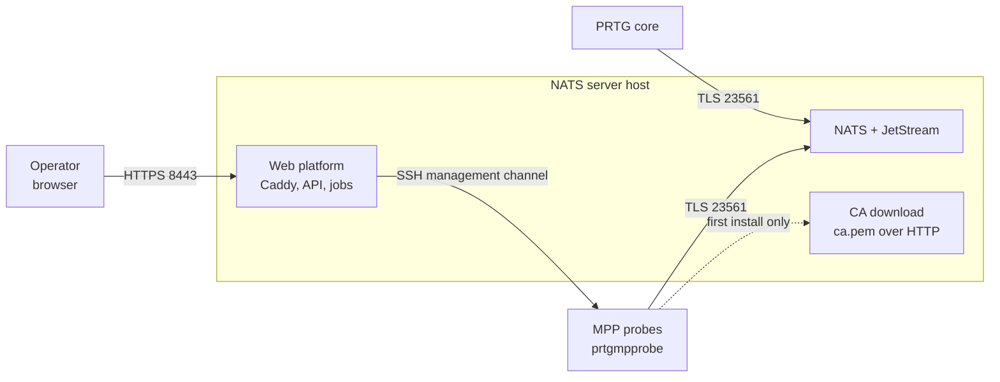

# 🚀 PRTG-NATS

A production-ready stack for the external NATS server used by PRTG
multi-platform probes (MPP), and a web platform to administer it. The stack
replaces **only the NATS server** - the probes keep running as native packages
on their own Linux systems.

## ✨ Features

- **One command per task.** `./prtg-nats` sets the server up, rolls out a
  probe, rotates a password and takes a backup; nothing needs a hand-written
  `.env` or a wizard.
- **A probe is installed, not configured by hand.** Package, CA, generated
  configuration and the PRTG access key in one transactional run - and if it
  fails, the probe restores its previous state on its own.
- **Every probe gets its own NATS account.** The server stores only bcrypt
  hashes; rotation updates server and probe together, or rolls both back.
- **One restricted channel to a probe.** A forced-command SSH key that cannot
  open a shell, pinned host keys, and a helper that validates every request.
- **Sensors are versioned here, not on the probe.** Monitoring scripts live in
  `sensors/` and are pushed to any number of probes with one command.
- **An optional web platform** with roles, jobs, live logs and an audit trail
  that cannot be edited - in English and German.

## 🏗 Architecture



Two containers carry the backbone: NATS with JetStream, and a read-only HTTP
server that publishes nothing but the public CA, so a probe can establish trust
before it has any credentials. The whole picture, including what happens inside
the host, is in [docs/architecture/overview.md](docs/architecture/overview.md);
why it is built this way is in
[architecture/decisions/](docs/architecture/decisions/).

## 📦 Installation

```bash
git clone <REPOSITORY-URL> /opt/prtg-nats-server
cd /opt/prtg-nats-server
sudo ./prtg-nats setup
```

`setup` asks for the site settings - FQDN, addresses, ports - writes them to
`.env`, and then sets up certificates, credentials and containers. The full
walkthrough with prerequisites and the checks afterwards is in
[docs/getting-started/install-the-server.md](docs/getting-started/install-the-server.md).

## ⚙️ Configuration

The settings that have no sensible default:

| Name | What it is | Example |
| --- | --- | --- |
| `NATS_FQDN` | name the core and every probe connect through | `nats.example.com` |
| `NATS_HOST_IP` | host address the containers publish on | `192.0.2.10` |
| `PRTG_CORE_IP` | address of the PRTG core | `192.0.2.20` |

Show them with `./prtg-nats config`, change them with
`sudo ./prtg-nats config --edit`. Every option, including the ports and the
web platform, is in
[docs/reference/configuration.md](docs/reference/configuration.md).

## ▶️ Quick start

Once the server runs, [connect the PRTG core](docs/getting-started/connect-prtg-core.md)
and [roll out the first probe](docs/getting-started/add-your-first-probe.md):

```bash
sudo ./prtg-nats install-mpp admin@probe-01.example.com --nats-user mpp-probe-01
```

That creates the NATS account, sets up the restricted management access,
installs the package and the CA, generates the configuration, starts the
service and prints the PRTG access key.

## 📖 The web platform

Optional, and the way this project is heading. It reads the same `runtime/`
directory and speaks the same management protocol to the same probes, so it can
be used alongside the shell tooling.

```bash
docker compose up -d
```

Then open `https://<NATS_FQDN>:8443`. The first visit asks you to create the
administrator; there is no default password.

What it gives you over the shell:

- a dashboard that answers whether the platform is operational and whether
  anything needs doing;
- probe and sensor management with search, filters and bulk actions;
- sensor rollouts as jobs, with live progress, a structured log and a failure
  you can act on;
- roles - viewer, operator, administrator - instead of a shared root shell;
- an audit trail of every administrative action, which cannot be edited;
- English and German.

See [docs/web/install.md](docs/web/install.md) and, before you deploy it,
[docs/security/threat-model.md](docs/security/threat-model.md).

## 🔌 API

The management API lives under `/api/v1`, authenticates with a session cookie,
and answers `202` with a job for anything that takes time. The OpenAPI schema
is at `/api/openapi.json`; the reference is
[docs/reference/api.md](docs/reference/api.md).

## 📊 Monitoring

Both containers carry health checks, `./prtg-nats verify` proves the
installation end to end with a real authenticated login, and the stack serves a
PRTG-shaped endpoint at `/cgi-bin/nats-health` with seven JetStream channels.
What to watch and what healthy looks like is in
[docs/guides/monitoring.md](docs/guides/monitoring.md).

## 🔒 Security

TLS with a CA of its own, a NATS account per probe, bcrypt hashes instead of
passwords in the server configuration, and a management key that can only run
one validated helper. Cleartext credentials and private keys live exclusively
in git-ignored directories, and no instance-specific CA is ever committed.

The full model is [docs/security/model.md](docs/security/model.md); what the
web platform is trusted with, stated plainly, is
[docs/security/threat-model.md](docs/security/threat-model.md).

## 🧪 Testing

```bash
./tests/check-static.sh          # seconds, no Docker and no network
./tests/e2e-mpp.sh               # minutes, with Docker and network access
cd web/backend && pytest -q      # the management API
cd web/frontend && npm run test  # the interface
```

The end-to-end test rolls out a complete probe in throwaway containers and
checks it against a real `prtgmpprobe`. Everything runs in Gitea Actions too -
in pull requests and on merges to `dev` or `main`, see
[.gitea/workflows/ci.yaml](.gitea/workflows/ci.yaml).

## 🛠 Development

The shell tooling is still the way to install the server and add the first
probe, and the recovery path when the web platform is not available.

```bash
./prtg-nats help          # every command
```

The full command list is in [docs/reference/cli.md](docs/reference/cli.md).
Conventions, the checks to run per change, and the ground rules are in
[AGENTS.md](AGENTS.md) - shared by every contributor, human or agent.

## 🗂 Project structure

| Path | Why it exists |
| --- | --- |
| `prtg-nats` | the only entry point; every command is dispatched here, so there is one place to look |
| `libexec/` | the shell implementation behind it, internal on purpose - a new user-facing command belongs in `prtg-nats` |
| `install-mpp.sh` | runs *on the probe*, so it has to stand alone and be copyable to a host that has nothing yet |
| `sensors/` | monitoring scripts, one directory each, versioned centrally rather than maintained per probe |
| `config/` | templates rendered into `runtime/` - a fixed, reviewed default instead of a wizard answer |
| `http/` | the CGI endpoint that turns the NATS monitoring into PRTG channels |
| `web/` | the optional management platform: FastAPI backend, React frontend, Caddy |
| `tests/` | static checks and the end-to-end rollout against a real package |
| `docs/` | the documentation tree, organised by task |
| `runtime/` | generated state, certificates and secrets - git-ignored, and the source of truth |

## ❓ Troubleshooting

For any connection problem, the endpoint test comes first - it takes the same
path the probe does and names the phase it fails in, without changing anything:

```bash
sudo ./install-mpp.sh --nats-host nats.example.com --check-only
```

Symptoms, causes and measures are collected in
[docs/guides/troubleshooting.md](docs/guides/troubleshooting.md).

## 📚 Documentation

Start at [docs/README.md](docs/README.md). The pages are organised by task:

| | |
| --- | --- |
| [getting-started/](docs/getting-started/) | first installation, in order |
| [guides/](docs/guides/) | recurring tasks |
| [reference/](docs/reference/) | commands, configuration, REST API, PRTG lookups |
| [security/](docs/security/) | what is protected, and what is trusted |
| [web/](docs/web/) | the management platform |
| [architecture/](docs/architecture/) | how it fits together, and why |

Further reading:

- [Official Paessler MPP manual](https://manuals.paessler.com/multiplatformprobemanual.pdf)
- [Official PRTG NATS settings](https://manuals.paessler.com/probes.htm)
