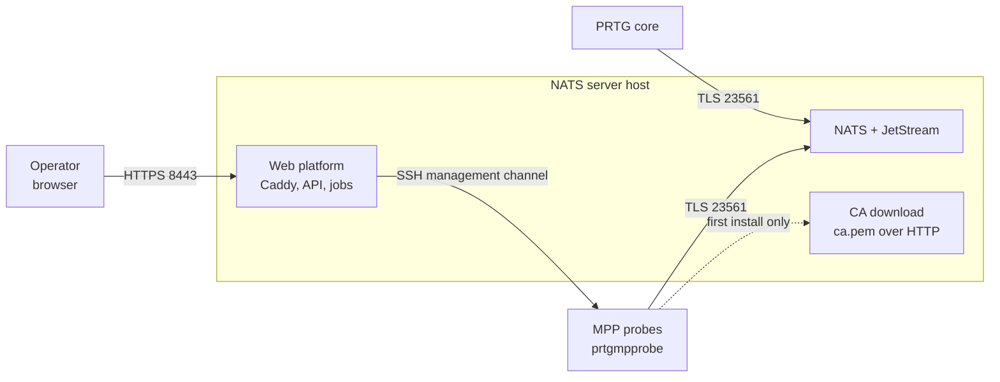

# PRTG-NATS

A production-ready stack for the external NATS server used by PRTG
multi-platform probes (MPP), and a web platform to administer it. The stack
replaces **only the NATS server** - the probes keep running as native packages
on their own Linux systems.



The whole picture, including what happens inside the host, is in
[docs/architecture/overview.md](docs/architecture/overview.md).

## In three steps

```bash
git clone <REPOSITORY-URL> /opt/prtg-nats-server
cd /opt/prtg-nats-server
sudo ./prtg-nats setup
```

`setup` asks for the site settings - FQDN, addresses, ports - writes them to
`.env`, and then sets up certificates, credentials and containers. Show them
with `./prtg-nats config`, change them with `sudo ./prtg-nats config --edit`.

Then [connect the PRTG core](docs/getting-started/connect-prtg-core.md) and
[roll out the first probe](docs/getting-started/add-your-first-probe.md):

```bash
sudo ./prtg-nats install-mpp admin@probe-01.example.com --nats-user mpp-probe-01
```

## The web platform

Optional, and the way this project is heading. It reads the same `runtime/`
directory and speaks the same management protocol to the same probes, so it can
be used alongside the shell tooling.

```bash
docker compose -f compose.yaml -f compose.web.yaml up -d
```

Then open `https://<NATS_FQDN>:8443`. The first visit asks you to create the
administrator; there is no default password.

What it gives you over the shell:

- a dashboard that answers whether the platform is operational and whether
  anything needs doing;
- probe and sensor management with search, filters and bulk actions;
- sensor rollouts as jobs, with live progress, a structured log and a failure
  you can act on;
- roles - viewer, operator, administrator - instead of a shared root shell;
- an audit trail of every administrative action, which cannot be edited;
- English and German.

See [docs/web/install.md](docs/web/install.md) and, before you deploy it,
[docs/security/threat-model.md](docs/security/threat-model.md) - the API
container is trusted with the installation directory and the Docker socket, and
that page says what follows from it.

## Documentation

Start at [docs/README.md](docs/README.md). The pages are organised by task:

| | |
| --- | --- |
| [getting-started/](docs/getting-started/) | first installation, in order |
| [guides/](docs/guides/) | recurring tasks |
| [reference/](docs/reference/) | commands, REST API, sensors, PRTG lookups |
| [security/](docs/security/) | what is protected, and what is trusted |
| [web/](docs/web/) | the management platform |
| [architecture/](docs/architecture/) | how it fits together, and why |

## The shell tooling

Still the way to install the server and to add the first probe, and the
recovery path when the web platform is not available.

```bash
./prtg-nats help          # every command
sudo ./prtg-nats tui      # the same tasks as a menu
```

The full command list is in [docs/reference/cli.md](docs/reference/cli.md).
Files under `libexec/` are internal; normal operation only calls
`./prtg-nats`.

## Tests

```bash
./tests/check-static.sh          # seconds, no Docker and no network
./tests/e2e-mpp.sh               # minutes, with Docker and network access
cd web/backend && pytest -q      # the management API
cd web/frontend && npm run test  # the interface
```

The end-to-end test rolls out a complete probe in throwaway containers and
checks it against a real `prtgmpprobe`. Everything runs in Gitea Actions too -
in pull requests and on merges to `dev` or `main`, see
[.gitea/workflows/ci.yaml](.gitea/workflows/ci.yaml).

## Further reading

- [Official Paessler MPP manual](https://manuals.paessler.com/multiplatformprobemanual.pdf)
- [Official PRTG NATS settings](https://manuals.paessler.com/probes.htm)
