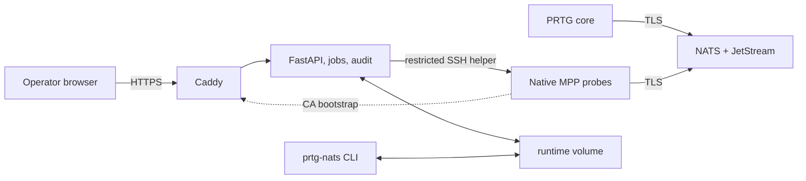

# PRTG-NATS

PRTG-NATS runs the external NATS and JetStream service used by PRTG
Multi-Platform Probes (MPP) and adds a web platform for operating it. It
replaces the NATS server and its administration layer; the probes remain native
`prtgmpprobe` packages on their Linux hosts.

The repository is for operators who install the central service, connect the
PRTG core, enroll probes, deploy sensors, and keep the fleet healthy.

## Quick start

On an Ubuntu x86-64 host with Docker Engine, Docker Compose v2, OpenSSL, and
Git:

```bash
sudo git clone --branch dev git@github.com:skiweg1985/prtg-nats.git /opt/prtg-nats
cd /opt/prtg-nats
sudo ./prtg-nats setup
sudo ./prtg-nats verify
```

`setup` asks for the site FQDN, host address, and PRTG core address. It creates
the runtime volume, certificates, and NATS accounts, then starts the stack.
Open `https://<NATS_FQDN>` and create the first administrator on the first
visit.

Before running this on a real host, read the prerequisites and network
boundaries in [Install the server](docs/getting-started/install-the-server.md).

## First useful result

1. Connect the PRTG core to the new NATS endpoint and trust the installation
   CA by following [Connect the PRTG core](docs/getting-started/connect-prtg-core.md).
2. Open **Probes**, choose **Add probe**, and follow
   [Add your first probe](docs/getting-started/add-your-first-probe.md).
3. Add that probe's access key to PRTG and approve the connection request.
4. [Deploy a sensor](docs/guides/deploy-sensors.md) and confirm that PRTG
   receives current readings.

The probe enrollment command is a short-lived invitation. Run it on the probe
as a user who can use `sudo`; the probe installs the restricted management
channel and reports back. The platform never needs the host's administrator
password.

## How it works



Caddy serves the interface and the public CA. The API runs jobs, manages the
runtime state, and talks to probes through a forced-command SSH helper that
cannot open a shell. NATS sees only its configuration, certificates, and
bcrypt password hashes. Certificates, credentials, probe inventory, jobs, and
audit data live in the `prtg-nats-runtime` volume.

The full component and trust-boundary map is in
[Architecture overview](docs/architecture/overview.md). The durable reasons
behind it are recorded in
[Architecture decisions](docs/architecture/decisions/).

## Choose the next task

| I want to... | Go to... |
| --- | --- |
| install or verify the server | [Install the server](docs/getting-started/install-the-server.md) |
| add or recover a probe | [Add your first probe](docs/getting-started/add-your-first-probe.md) |
| deploy or configure sensors | [Deploy sensors](docs/guides/deploy-sensors.md) |
| add an iperf3 measurement endpoint | [Measurement endpoints](docs/guides/deploy-sensors.md#measurement-endpoints) |
| update, back up, restore, or rotate credentials | [Operations and maintenance](docs/guides/operations.md) |
| decide whether the installation is healthy | [Monitoring](docs/guides/monitoring.md) |
| diagnose a known failure | [Troubleshooting](docs/guides/troubleshooting.md) |
| look up a command or setting | [CLI reference](docs/reference/cli.md) and [configuration reference](docs/reference/configuration.md) |
| integrate with the management API | [REST API](docs/reference/api.md) |
| review privileges and secret custody | [Security model](docs/security/model.md) and [web threat model](docs/security/threat-model.md) |

The complete task index is [docs/README.md](docs/README.md).

## Operate safely

The runtime volume is the installation. Back it up separately from JetStream;
the latter contains messages, while the runtime contains the CA key,
credentials, probe inventory, web database, and management keys.

```bash
sudo ./prtg-nats status
sudo ./prtg-nats verify
sudo ./prtg-nats backup
```

Never run `docker compose down --volumes`: it deletes persistent data. Use the
documented [backup and restore procedures](docs/guides/operations.md) before a
change that affects certificates, credentials, storage, or the update path.

## Development and checks

The shell entry point is `prtg-nats`; `libexec/` is internal. The web platform
is a FastAPI backend and React frontend that operate on the same runtime state
as the CLI.

Run the checks for the area changed:

```bash
./tests/check-static.sh
./tests/check-job-messages.py
npx --yes markdownlint-cli2 "**/*.md"
cd web/backend && ruff check . && ruff format --check . && mypy app && pytest -q
cd web/frontend && npm run lint && npm run typecheck && npm run test && npm run i18n:check
```

The complete repository conventions and end-to-end checks are in
[AGENTS.md](AGENTS.md).
