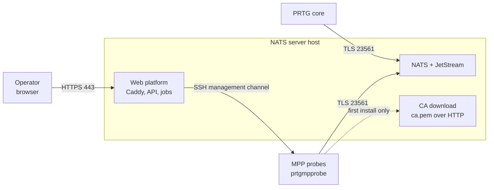
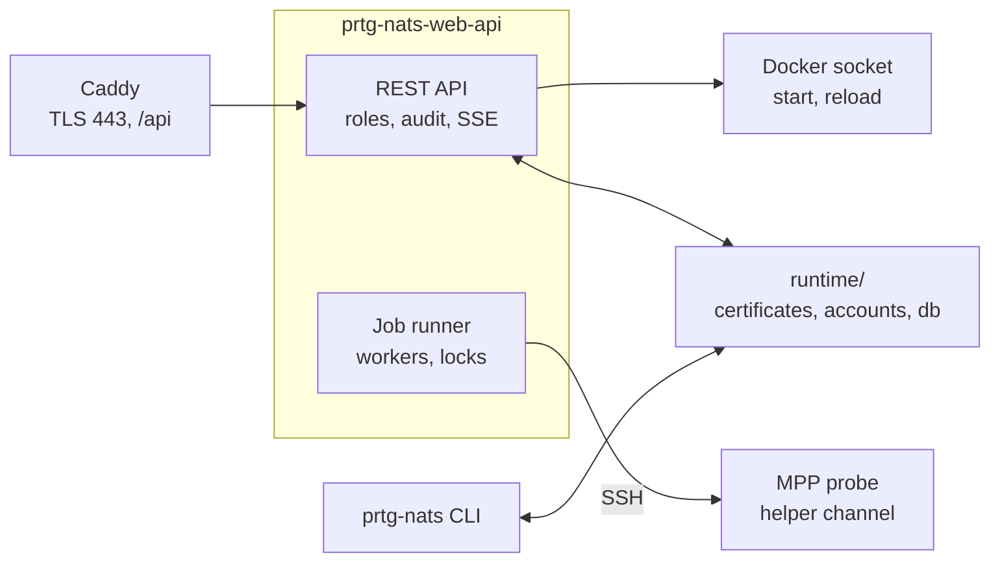

# Architecture overview

What the pieces are and how they reach each other. Why they are arranged
this way is in [decisions/](decisions/) - this page is the map, not the
argument.

## From outside

The stack replaces the NATS server that the PRTG core and the
multi-platform probes talk to, and adds a web platform to administer it.
The probes keep running as native `prtgmpprobe` packages on their own
Linux systems; nothing of this platform is installed on them except a
restricted management access.

One file describes the whole stack ([compose.yaml](../../compose.yaml)):
NATS with JetStream, the API, a build step that drops the interface into a
volume, and Caddy in front of both. Caddy also publishes
`runtime/public/nats-ca.pem` over plain HTTP, so a probe can fetch the CA
before it has any credentials - that used to be a container of its own.

A short-lived init step runs first and creates the directories the other
containers mount by subpath. They mount subpaths rather than the whole
volume so that NATS sees its configuration and certificates but never the
CA key, the credentials, or the interface's private key.

## Inside the host

The API container joins the host network namespace. That is what makes
`127.0.0.1:8100` the API and `127.0.0.1:8222` the NATS monitoring
endpoint - the same addresses the shell tooling uses, with no second set
of names to keep in sync. It also means an outgoing SSH connection leaves
from the host's own address, which is what the `from="…"` restriction on
the management key expects.

## What the arrangement rests on

**`runtime/` is the source of truth, not the database.** Certificates,
NATS accounts and the probe inventory are files there, in the formats the
shell tooling created. `runtime/web.db` holds only what has no file
representation: web accounts, sessions, jobs, the audit trail. This is why
both interfaces can be used side by side -
[ADR 0002](decisions/0002-runtime-stays-the-source-of-truth.md).

**There is one channel to a probe, and it cannot open a shell.** The
platform speaks a typed protocol to `prtg-nats-probe-helper`, over a key
whose `authorized_keys` entry forces exactly that command. Same key, same
pinned `known_hosts` as the shell tooling -
[ADR 0001](decisions/0001-speak-the-probe-protocol-directly.md).

**The helper renews itself over that channel, against a signature.** The
management key opens the channel; a separate key in `runtime/private/`
authorises the code that goes through it, and the probe verifies before it
replaces anything -
[ADR 0006](decisions/0006-signed-helper-updates.md).

**No broker and no second process.** The job runner is a handful of
asyncio tasks inside the API process, claiming rows from the job table.
One server does not need a message queue to keep alive -
[ADR 0004](decisions/0004-one-process-no-broker.md).

**Server-side operations are Python, not wrapped scripts.** Certificates,
accounts, backups and verification are functions with unit tests, and the
`prtg-nats` command delegates to the same code through `python -m app.ops`.
See [ADR 0005](decisions/0005-retire-the-shell-management-layer.md).

## What is still shell, and why

`prtg-nats` remains the bootstrap and the recovery path: the `.env`
dialog, the compose lifecycle, and the initial rollout of a probe
(`install-mpp`). The first contact with a probe needs something the
management channel deliberately cannot do - authenticate as an
administrator, copy files, install a package as root, and confirm an
unknown SSH host key interactively.

So a probe reaches the platform over two different channels, and only the
second one exists in both tools:

| | Bootstrap channel | Management channel |
| --- | --- | --- |
| Exists in | shell tooling only | shell tooling and web platform |
| Authenticates as | an administrator on the probe | `prtg-nats-admin` |
| Can do | anything root can do | the helper protocol, nothing else |
| Used for | enrollment, package install | everything afterwards |
| Host key | confirmed interactively, then pinned | must already be pinned |

Once enrolment has happened, the web platform is complete: configuration,
certificates, sensors, reconciliation, rotation and unenrolment all run
over the management channel as jobs.
