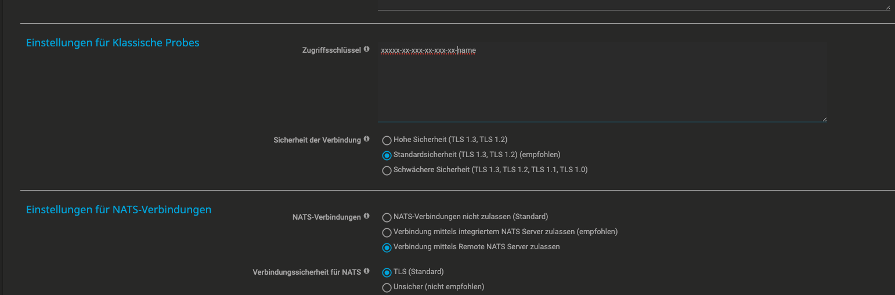

# Add your first probe

Use the web platform to enroll a native PRTG Multi-Platform Probe on Ubuntu,
Debian, Raspberry Pi OS, or RHEL 9. The probe enrolls itself through a
single-use invitation; the platform does not need its administrator password.

## Before you start

The target host needs:

- a user that can run `sudo`;
- outbound access to the web interface over HTTPS and to the public CA endpoint
  over HTTP;
- outbound TLS access to the configured NATS endpoint;
- access to `packages.paessler.com` when the `prtgmpprobe` package is not
  already installed.

After the host reports in, the NATS server must be able to reach its management
address over TCP `22`. If the callback crosses NAT, enter that reachable
address explicitly instead of letting the platform use the callback source
address.

The installer detects Debian- and RHEL-family systems and uses their native
package manager and architecture. Before extending a rollout to another
distribution or release, check the currently supported targets in the
[Paessler MPP manual](https://manuals.paessler.com/multiplatformprobemanual.pdf).

## 1. Create an invitation

1. Sign in to the web interface.
2. Open **Probes** and choose **Add probe**.
3. Enter a dedicated NATS account such as `mpp-berlin-01`.
4. Optionally enter the name PRTG should show and the address the platform
   should use for later management.
5. Leave **Install the prtgmpprobe package** enabled unless another process
   already manages that package.
6. Choose **Create the command**.

Creating the invitation does not contact the host and does not create the NATS
account. An unused invitation therefore leaves no account or inventory behind.

The next page shows the command, the CA fingerprint, and the remaining
lifetime. Treat the command as a secret: until it is used or expires, anyone
who has it can enroll a host under that NATS account. Cancel the invitation if
it was copied to the wrong place.

## 2. Run the command on the probe

Copy the generated command and run it on the target host as a user who can use
`sudo`. Use the command exactly as shown; it contains a short-lived token and
is different for every invitation.

The command:

1. downloads the public CA over HTTP;
2. verifies its SHA-256 fingerprint before using it for HTTPS;
3. downloads only the fixed bootstrap assets allowed for probe enrollment;
4. installs the restricted `prtg-nats-admin` management access;
5. installs the signed Paessler package when requested;
6. reports the host key, package result, and management address back to the
   platform.

The invitation is spent when the host reports back. The platform then pins the
host key, creates the NATS account, writes the probe inventory, installs the CA
and configuration, starts `prtg.mpprobe.service`, and waits for the NATS
connection. The page follows that job and shows the complete log.

Enrollment is transactional. A failed configuration or service check restores
the previous probe state. If the host has already reported in, retry a
temporary job failure from the job page. Create a new invitation only when the
host must run the bootstrap command again.

## 3. Add the access key in PRTG

The platform cannot make the two remaining changes on the PRTG core. Open the
new probe's **Overview** tab and reveal its **PRTG access key**. The disclosure
is recorded in the audit trail.

In PRTG, open:

`Setup > System Administration > Probes > Probe Connection Settings`

Add the complete access key as a new line in **Access Keys** and save. Do not
replace existing keys and do not put the key in this repository, screenshots,
or tickets.



The screenshot uses a masked example. The real value remains unique to the
probe and does not change when the display name changes later.

## 4. Approve and test the probe

When the connection request appears in PRTG:

1. Check the probe name and expected host.
2. Select **Approve**.
3. Do not select **Approve and auto-discover**.
4. Create one test device and one supported sensor manually.
5. Confirm current readings and the connection health sensor.

If the probe was denied earlier, remove its GID from **Deny GIDs** in the probe
connection settings and restart `prtg.mpprobe.service` on the host.

## Completion check

- [ ] the probe has a dedicated NATS account and PRTG access key
- [ ] the enrollment job finished successfully
- [ ] the probe page shows current service, CA, helper, and NATS state
- [ ] the access key is an additional line in PRTG
- [ ] the connection request was approved without auto-discovery
- [ ] a test sensor returns current readings
- [ ] the probe address is included in the intended firewall rules

## Alternative: enroll from the NATS host

Use the shell path when inbound bootstrap SSH is available or the web platform
is unavailable. It opens one administrator SSH session for the first install,
then switches to the same restricted management channel used by the web
platform:

```bash
cd /opt/prtg-nats
sudo ./prtg-nats install-mpp admin@probe-01.example.com \
  --nats-user mpp-probe-01
```

Preview the sequence without changing the target:

```bash
./prtg-nats install-mpp admin@probe-01.example.com \
  --nats-user mpp-probe-01 \
  --dry-run
```

Later runs need no administrator target once the probe is enrolled:

```bash
sudo ./prtg-nats install-mpp --nats-user mpp-probe-01
```

The exact flags, rollback behavior, and manual enrollment commands are in the
[CLI reference](../reference/cli.md#probe-rollout). If the supported
installer cannot run, follow
[Install a probe by hand](../guides/manual-probe-install.md).

## If enrollment fails

Start with the endpoint test on the probe. It follows the same DNS, TCP, NATS
greeting, and TLS path as `prtgmpprobe` without changing the host:

```bash
sudo ./install-mpp.sh --nats-host nats.example.com --check-only
```

Use the enrollment job log for package, management-channel, configuration, and
service failures. The symptom-based next actions are in
[Troubleshooting](../guides/troubleshooting.md).
